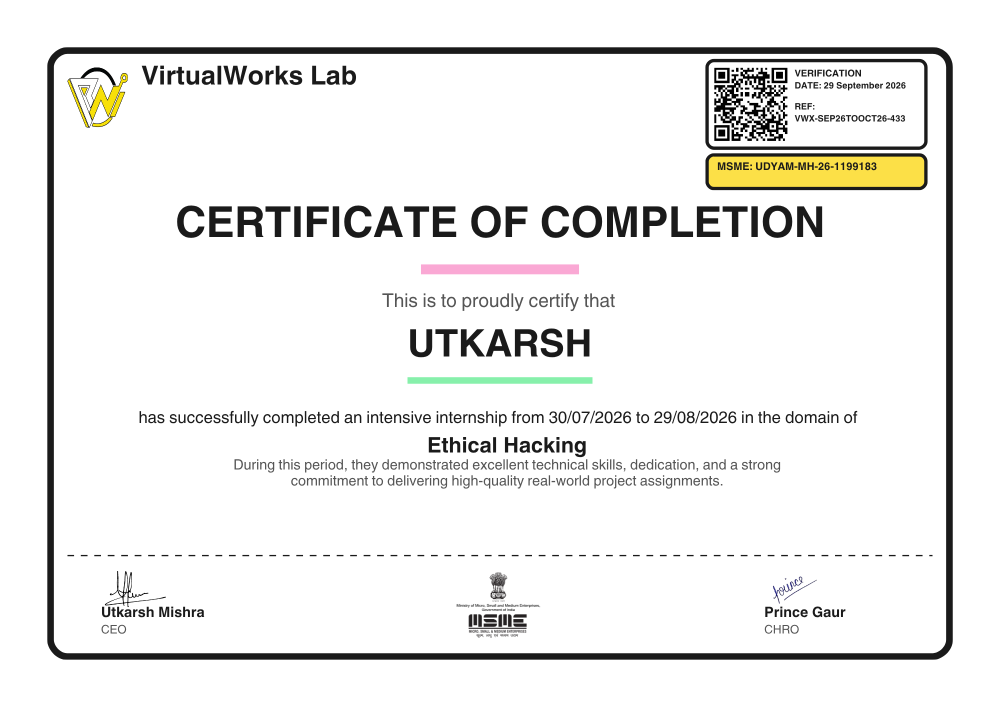
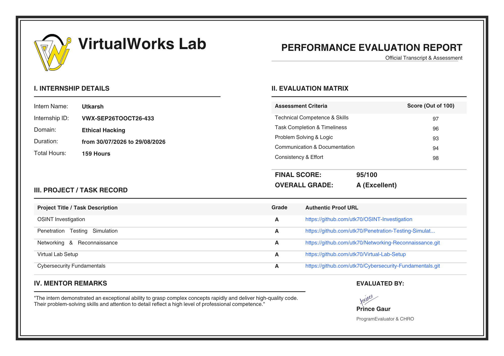

# Cybersecurity Internship Portfolio

> **159-Hour Cybersecurity Internship — Practical Security, Penetration Testing, Reconnaissance & OSINT**

This repository serves as a comprehensive portfolio of my **159-hour cybersecurity internship**, documenting my progression from foundational security concepts and threat modeling to hands-on network reconnaissance, vulnerability assessment, controlled exploitation, post-exploitation verification, and Open-Source Intelligence (OSINT).

The internship focused on developing practical cybersecurity skills through a controlled and isolated virtual laboratory environment.

---

## Internship Overview

| Category | Details |
|---|---|
| Duration | 159 Hours |
| Domain | Cybersecurity & Ethical Hacking |
| Attacker Environment | Kali Linux |
| Target Environment | Metasploitable |
| Reconnaissance | Nmap, WHOIS, DNS, Sublist3r |
| Exploitation | Metasploit Framework |
| OSINT | theHarvester, Shodan, Certificate Transparency |
| Lab Network | Isolated Virtual Environment |
| Final Score | 95/100 — Grade A |

---

## Certificate

I successfully completed the cybersecurity internship and received a certificate recognizing my performance and completion of the program.

<p align="center">
  
</p>
<p align="center">
  
</p>

**Final Evaluation:** 95/100 — Grade A (Excellent)

---

# 1. Foundational Security & Threat Modeling

The internship began with fundamental cybersecurity principles, security models, and threat analysis.

## Strategic Defense

Studied and applied the **CIA Triad**:

- **Confidentiality** — protecting information from unauthorized access
- **Integrity** — ensuring information is not improperly modified
- **Availability** — ensuring systems and services remain accessible

Security mechanisms explored included:

- Encryption for confidentiality
- Hashing for integrity verification
- Availability and DDoS mitigation concepts

## Threat Intelligence

Explored different categories of threat actors and their motivations:

- White Hat
- Black Hat
- Gray Hat

Also studied common modern attack vectors including:

- Malware
- Phishing
- Ransomware
- Social Engineering
- Credential Compromise

---

# 2. Secure Cybersecurity Lab Architecture

A controlled virtual laboratory was created to safely perform penetration-testing exercises.

## Lab Architecture

```text
                 +----------------------+
                 |      Kali Linux      |
                 |     Attacker VM      |
                 +----------+-----------+
                            |
                     Isolated Network
                            |
                            v
                 +----------------------+
                 |    Metasploitable    |
                 |      Target VM       |
                 +----------------------+
```

### Environment

- Kali Linux as the attacker environment
- Metasploitable as the intentionally vulnerable target
- Host-Only networking for isolation
- Controlled virtual-machine resources
- Safe-to-fail environment for security experimentation

Typical VM resources included:

- 2–4 vCPU
- 2048 MB RAM

All exploitation activities were conducted against intentionally vulnerable systems within an authorized laboratory environment.

---

# 3. Intelligence Gathering & Reconnaissance

The next stage focused on identifying information about systems and their exposed attack surfaces.

## Passive Reconnaissance

Explored OSINT techniques that rely on publicly available information.

### Tools

```text
WHOIS
DNS / dig
Certificate Transparency
Sublist3r
```

Example:

```bash
whois example.com
```

```bash
dig MX example.com
```

These techniques can help identify:

- Domain information
- DNS records
- Mail servers
- Name servers
- Subdomains
- Publicly visible infrastructure

## Active Reconnaissance

Hands-on network enumeration was performed within the controlled laboratory.

### Host Discovery

```bash
ping -c 4 10.96.12.193
```

### Service Enumeration

```bash
nmap -sC -sV -p- -T4 10.96.12.193
```

The scan was used to identify:

- Open ports
- Running services
- Service versions
- Potential attack surfaces

---

# 4. Vulnerability Assessment & Controlled Exploitation

A vulnerable FTP service was identified during the laboratory assessment.

## Vulnerability Discovery

The target was found running:

```text
vsftpd 2.3.4
```

This version is associated with **CVE-2011-2523**, a known backdoor vulnerability.

## Metasploit

The Metasploit Framework was used to demonstrate exploitation within the isolated environment.

```bash
msfconsole
```

The relevant module was identified using:

```text
search vsftpd
```

The authorized laboratory target was then configured for the exercise.

## Post-Exploitation Verification

Following successful exploitation, basic system commands were used to verify the resulting shell:

```bash
whoami
```

```bash
uname -a
```

The laboratory exercise demonstrated how a vulnerable exposed service can potentially lead to unauthorized system access.

> These techniques should only be used against systems where explicit authorization has been granted.

---

# 5. Attack Surface Mapping & Digital Footprinting

The internship also covered OSINT-based attack-surface discovery.

## Subdomain Discovery

Subdomain enumeration was performed using tools such as:

```bash
sublist3r -d example.com
```

Certificate Transparency data was also studied to identify publicly recorded hostnames.

Example findings:

```text
dev.example.com
vpn.example.com
staging.example.com
```

## Public Email Discovery

TheHarvester was explored for discovering publicly indexed information associated with a domain.

```bash
theHarvester -d example.com -l 200 -b all
```

The resulting information can help security teams understand their publicly exposed digital footprint.

## Breach Exposure Analysis

Public breach-notification services such as Have I Been Pwned were studied to understand whether discovered email addresses had appeared in known third-party breaches.

Breach exposure does not automatically indicate that an organization's own infrastructure has been compromised.

## External Infrastructure Discovery

Shodan was explored as an internet-wide search engine for publicly observable devices and services.

Example query:

```text
org:"Example Company Inc" port:"3389"
```

This can help security teams identify potentially exposed remote-access services such as RDP.

Defensive considerations include:

- Reducing unnecessary internet exposure
- Enforcing multi-factor authentication
- Restricting remote access
- Applying security patches
- Monitoring authentication activity
- Implementing appropriate firewall controls

---

# 6. Internship Tasks

| Task | Topic | Primary Skills |
|---|---|---|
| Task 1 | Security Fundamentals | CIA Triad, Threat Modeling |
| Task 2 | Secure Lab Setup | Kali Linux, Metasploitable, Virtual Networking |
| Task 3 | Networking & Reconnaissance | Nmap, WHOIS, DNS, Ping |
| Task 4 | Penetration Testing Simulation | Nmap, Metasploit, Vulnerability Assessment |
| Task 5 | OSINT Investigation | Sublist3r, theHarvester, Shodan, HIBP |

---

# 7. Skills Developed

## Cybersecurity

- Security Fundamentals
- CIA Triad
- Threat Modeling
- Vulnerability Assessment
- Penetration Testing
- Post-Exploitation Concepts
- Attack Surface Analysis

## Networking

- IP Addressing
- TCP/IP
- DNS
- Ports and Services
- ICMP
- Network Enumeration

## Reconnaissance

- Nmap
- WHOIS
- DNS Enumeration
- Subdomain Discovery
- Certificate Transparency

## OSINT

- theHarvester
- Shodan
- Public-source intelligence
- Digital Footprint Analysis
- Breach Exposure Awareness

## Professional Skills

- Technical Documentation
- Security Reporting
- Problem Solving
- Research
- Virtual Lab Management

---

# 8. Performance Evaluation

The internship concluded with a formal performance evaluation.

```text
+-----------------------------+
|       FINAL SCORE            |
|                             |
|          95 / 100            |
|                             |
|       Grade A - Excellent    |
+-----------------------------+
```

The evaluation covered areas including:

- Technical cybersecurity knowledge
- Problem-solving ability
- Practical implementation
- Documentation
- Understanding of security concepts

The program evaluator also recognized my ability to understand complex cybersecurity concepts quickly and deliver professional-quality work.

---

# 9. Evidence & Documentation

Each task contains supporting documentation and screenshots demonstrating the practical work performed during the internship.

Examples include:

- Nmap scan results
- Metasploit execution
- Shell verification
- DNS enumeration
- OSINT tool output
- Lab architecture
- Security assessment documentation

---

# 10. Learning Journey

```text
Security Fundamentals
        |
        v
Threat Modeling
        |
        v
Secure Lab Architecture
        |
        v
Networking Fundamentals
        |
        v
Passive Reconnaissance
        |
        v
Active Enumeration
        |
        v
Vulnerability Identification
        |
        v
Controlled Exploitation
        |
        v
Post-Exploitation Verification
        |
        v
OSINT & Digital Footprinting
        |
        v
Security Analysis & Reporting
```

---

# 11. Internship Outcome

This 159-hour internship provided hands-on exposure to the cybersecurity assessment lifecycle, connecting theoretical security concepts with practical laboratory exercises.

The experience strengthened my understanding of:

```text
Reconnaissance
      |
      v
Enumeration
      |
      v
Vulnerability Identification
      |
      v
Controlled Exploitation
      |
      v
Verification
      |
      v
Intelligence Analysis
      |
      v
Documentation
```

The internship also provided a foundation for continuing into more advanced areas of:

- Penetration Testing
- Vulnerability Research
- Network Security
- OSINT
- Security Assessment
- Defensive Security

---

# Ethical & Legal Disclaimer

This repository is intended strictly for **educational and authorized cybersecurity research**.

The penetration-testing techniques demonstrated here were performed in a controlled laboratory environment against intentionally vulnerable systems.

Do not use these techniques against systems, networks, accounts, or organizations without explicit authorization.

The author does not endorse unauthorized access, credential theft, disruption of services, or malicious activity.

---

## Author

**Utkarsh Rajput**

Cybersecurity | CSE Student | Ethical Hacking | Network Security

---
